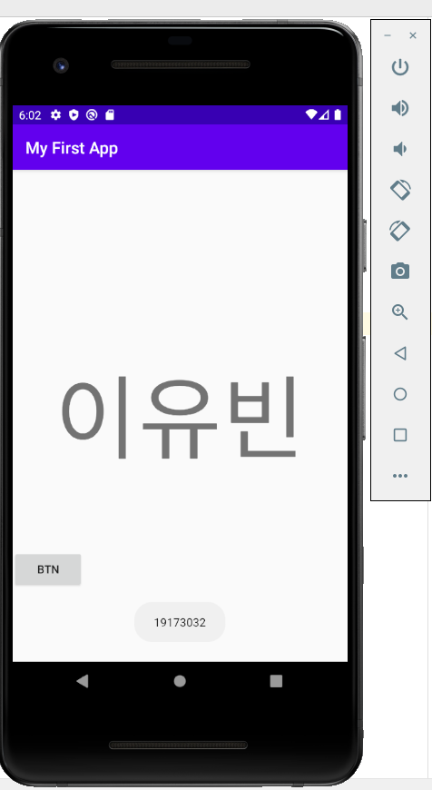
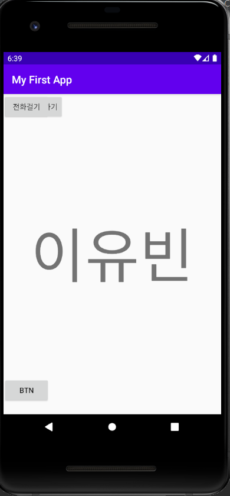
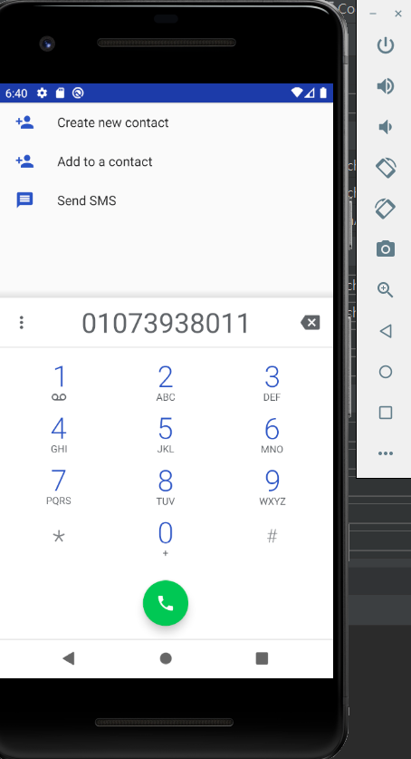
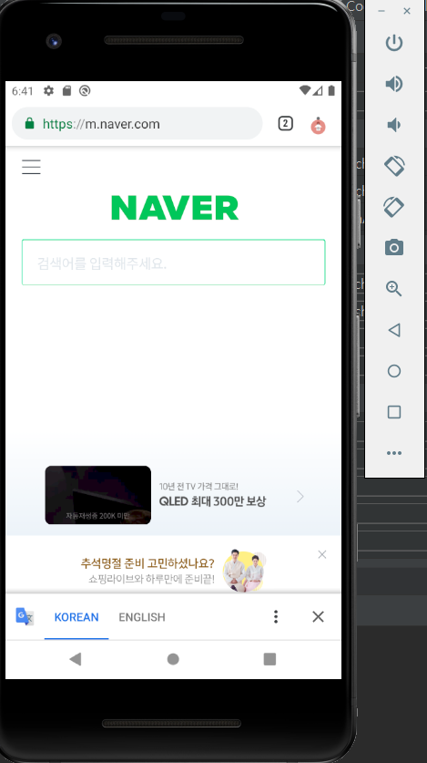
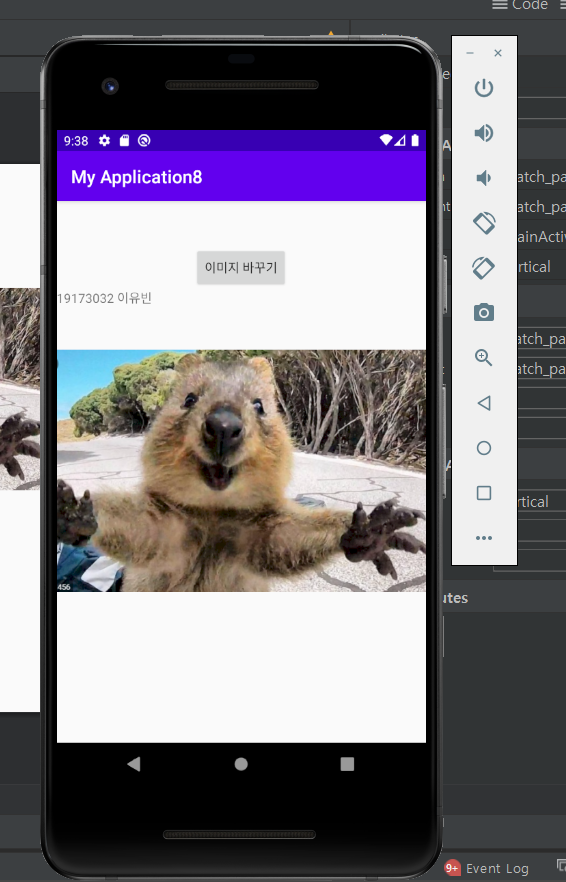
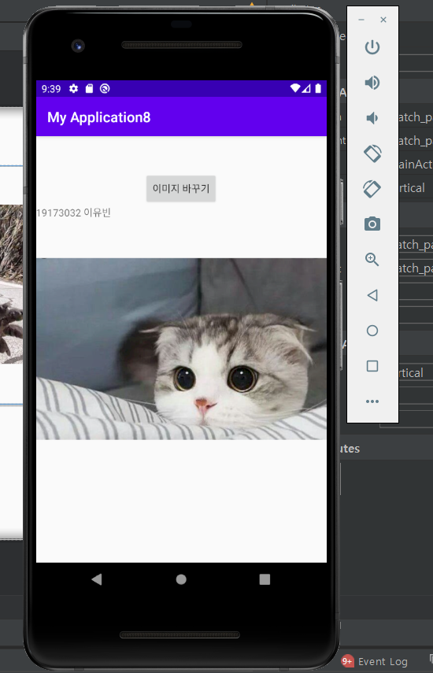
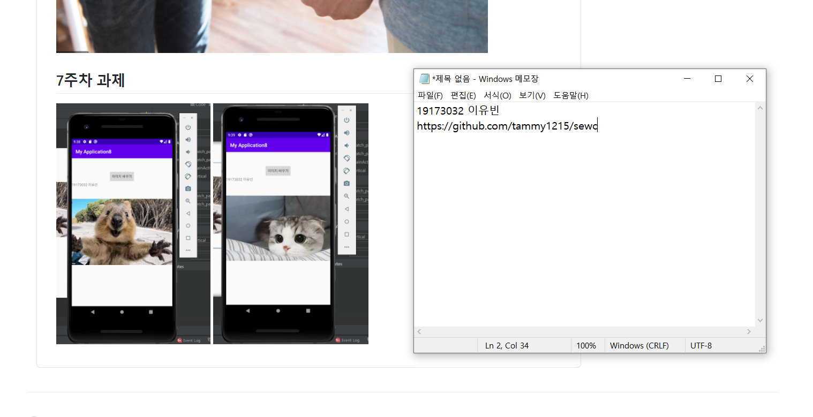

# 19173032 이유빈

## 1주차 과제

## 2주차 과제

  </img>

## 3주차 과제

 </img>
 </img>
 </img>

## 4주차 과제
   <빌린 물건을 받을 때 쓰기 유용한 앱> (뭐야 돌려줘요)
  : 사람들이 흔히 물건을 빌려줄 때, 서로 빌려주고 빌렸다는 사실을 잊어버리기도 합니다. 
    또한 돈을 빌려줬다고 했을 때, 빌려준 사람이 다시 돈을 달라고 하기에는 조금 어색한 상황이 생길 수 있습니다. 
    이를 방지하기 위해서 도서관 책 대출 앱처럼 만드는 것입니다. 빌려주는 기간을 정해놓고 그 기간 안에 빌려준 물건을 돌려주지 않으면, 그에 따른 불이익이 생기는 것입니다.
    물건을 빌린 입장에서도 대여 상황을 쉽게 확인할 수 있게 합니다. 
    예를 들어 대여기간이 3일이 남았다고 하면, 3일 남았다는 알림을 핸드폰에 뜨게 합니다. 
    이렇게 빌린 사람도, 빌려준 사람도 편하게 물건에 대해 얘기할 수 있게 됩니다. 

 </img>
  
## 7주차 과제

</img>
</img>
</img>

## 9주차 과제

</img>
</img>
</img>
</img>

## 10주차 과제 소스코드 

</img>
</img>
</img>
</img>
</img>

## 10주차 과제 실행화면
</img>
</img>
</img>

## 11주차 과제 실행화면
</img>
</img>
</img>
</img>

